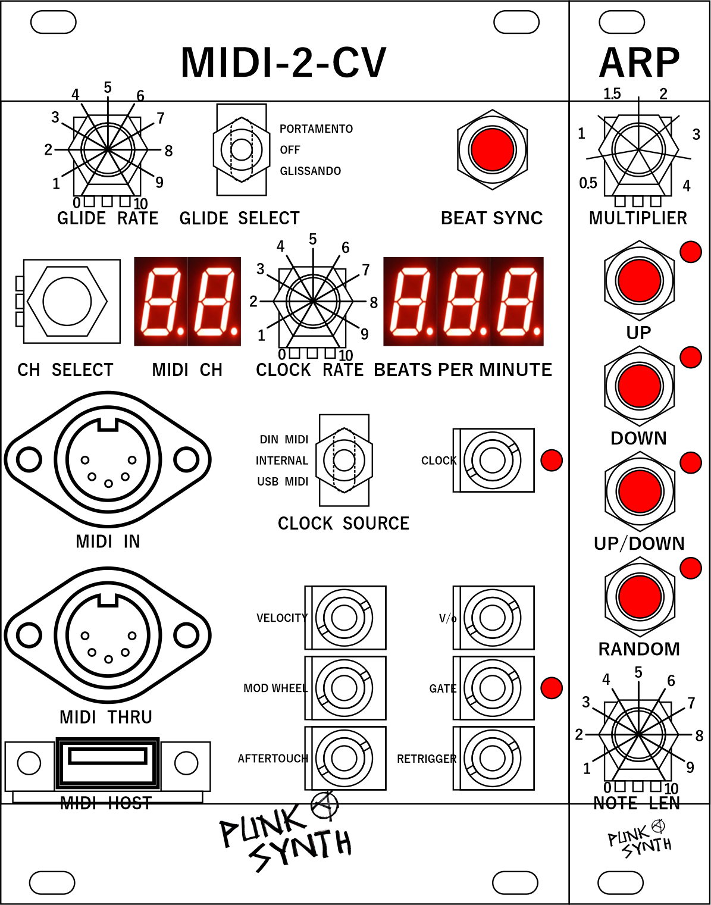

# MIDI-2-CV
MIDI-2-CV is a Raspberry Pi Pico based MIDI to CV converter.

## Introduction
The MIDI-2-CV is a Eurorack module. The reason why I developing this module is because it contains the functionality I want.
Here is a pic of the front panel.

The key MIDI functionality I want is a USB MIDI host so I can connect a keyboard, MIDI DIN in and thru. 
The main outputs are:
* V/o - volts per octave (16-bit resolution)
* Gate - 5V gate on, and GND gate off
* Retrigger - 5V retrigger pulse
* Velocity - Well, the velocity, how hard you hit the key (12-bit resolution)
* Mod Wheel - Modulation Wheel (12-bit resolution)
* Aftertouch - Aftertouch (12-bit resolution)

Auxilary output are:
* MIDI Clock - One beat for every quarter note
The MIDI Clock is selectable from different sources, and the beats per minute is displayed.
If internal clock is used it will be possible to press a beat sync.

Other specifications:
* The MIDI channel from the MIDI DIN is set by a rotary switch.
* The Pitch wheel is automatically routed through V/o output.
* Glide - Portamento or Glissando is selected by a switch. The glide rate is set by a potentiometer and the maximum glide is one half note per second. The glide is automatically routed through V/o output.
* It will be possible to add an arpeggiator module. In the picture above is JP4 clone arpeggiator.

## Schematics
The schematics are under construction so far.

## Code
The source code is developed in C and is located in the midi_to_cv folder.

## Usage
I have provided a pic showing the breadboard of the current setup.

## Contributing
Pull requests are welcome. For major changes, please open an issue first
to discuss what you would like to change.

## Licence
[GPLv3](https://www.gnu.org/licenses/gpl-3.0.en.html)
